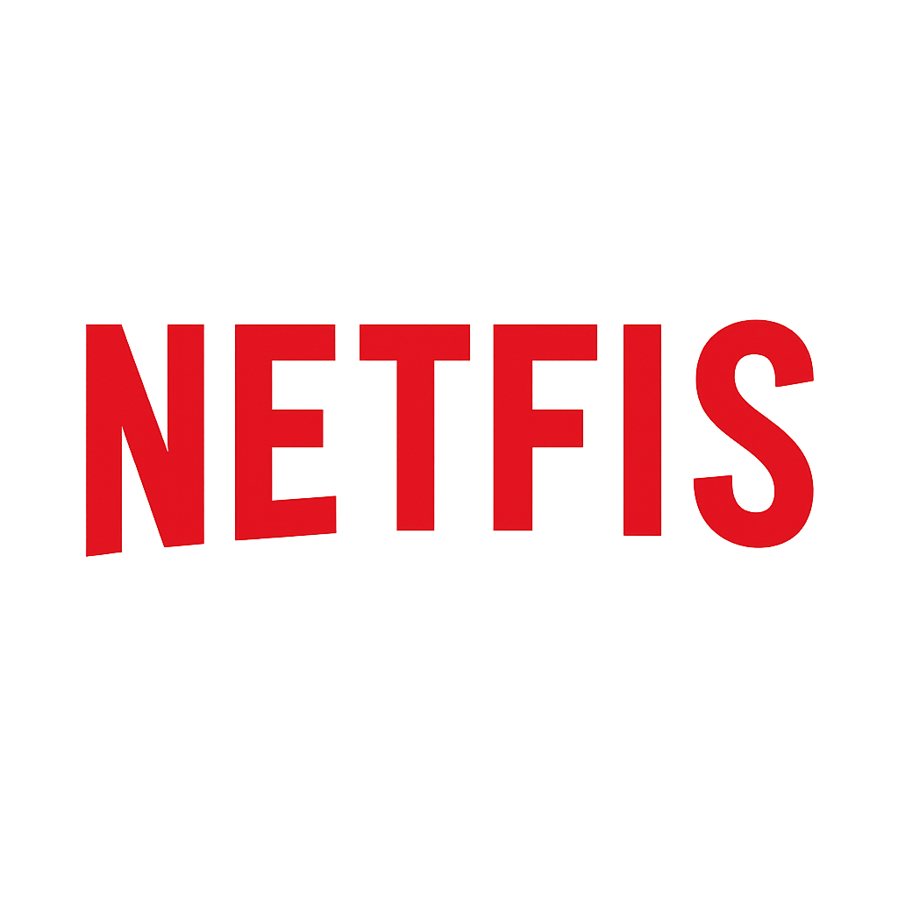

<p align="center">
  
</p>

Netfis is an improved clone of Netflix, a project made for educational purpose by Dragos Nedelcu and Davide Martinelli, built using **ReactJS** and **TailwindCSS**, optimized for speed, modern UI, and a smooth user experience.  
The project uses the TMDB API to display real-time movies and TV shows, including trailers, details, search, and favourites.

---

## 🚀 Technologies Used

### **ReactJS**
Chosen for its component-based architecture and efficient handling of dynamic user interfaces.

### **TailwindCSS**
Allows a fast development workflow thanks to utility classes, eliminating the need to write additional CSS files.

### **React Router DOM**
Used to manage navigation and pages without full-page reloads, ensuring a smooth SPA experience.

### **Swiper**
Enables modern, fluid sliding carousels similar to Netflix’s horizontal content lists.

### **Lucide React**
A lightweight and elegant icon library that provides a clean and professional look to the interface.

---

## 📂 Project Structure

```
src/
│
├── assets/            # Logo and graphical assets
├── components/        # Reusable UI components (Cards, Navbar, Loader, etc.)
├── context/           # MediaContext: global state and API data handling; FavouritesContext: store favourite films/tvseries
├── layouts/           # Main layout containing Navbar, Children, Footer.
├── pages/             # Main application pages (Homepage, Movies, Series, Details, Search)
├── services/          # Main file for fetching TMDB API
└── App.jsx            # Main React Router configuration
```

---

## ⚙️ Main Features

- Netflix-style homepage
- Movies and TV shows listings
- Dynamic hero with trailers
- Smooth navigation without page reload
- Favorites stored locally
- Animated loader
- Fully responsive layout
- Better UX / UI

---

## 🌐 API

The application uses **TMDB API** as the content source.

Create a `.env` file by cloning `.env.example`:

```
VITE_APP_BEARER_TOKEN=YOUR_API_KEY
```

---

## ▶️ Running the Project

Install dependencies:

```
npm install
```

Start the development server:

```
npm run dev
```

---

## 📜 License

Open-source project for educational and portfolio purposes.

---

## ✨ Author

Developed with passion by  
[Dragos Nedelcu](https://github.com/n3dydr4gos)
[Davide Martinelli](https://github.com/davide-its)

### 📩 Contact

nedydragos@gmail.com  
davide.martinelli15@gmail.com
